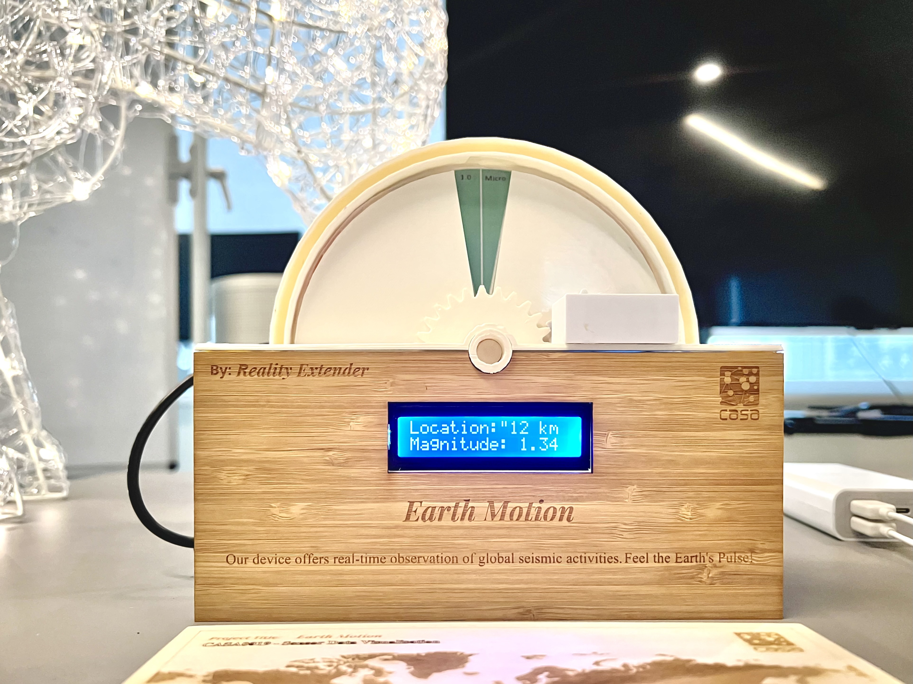

# EarthMotion: Real-Time Earthquake Activity Monitoring

## Project Theme
**Earthquakes - Climate Force**

    

Earthquakes are natural but impactful on lives and properties. Quick access to earthquake data is vital for disaster management and safety. IoT technology enables real-time seismic monitoring through APIs, establishing a global system to better understand geological events.

## Project Introduction
**EarthMotion** is an innovative initiative focused on real-time monitoring and visualization of global earthquake activities using seismic monitoring data APIs. This project has successfully implemented two distinct forms of data visualization:

- *Physical Device Visualization*: This involves the creation of a tangible apparatus that visually represents seismic data in real-time.
- *AR Twin Visualization*: Building upon the physical device, the AR Twin visualization creates a digital twin model of the apparatus. It not only mirrors the physical device but also displays data sources and broader range data in an augmented reality format.

The synergy between the physical device and its AR Twin allows for a comprehensive and immersive experience in understanding seismic activities, making EarthMotion a pioneering project in the field of geological monitoring and education.

### Data Acquisition and Display
- **API Integration**: We access APIs from external websites and upload real-time data to MQTT. Users can view the raw data through MQTT Explorer at `mqtt.cetools.org` with credentials `student/CASA0019/G4`.
- **Hardware Communication**: The Arduino Uno Wi-Fi Rev2 board is utilized to enable data flow to each terminal hardware.

### Visualization Methods
1. **LCD Display (16*2)**: It presents location and magnitude information. The first line scrolls to show the exact location, while the second line displays the magnitude.
2. **Servo Mechanism**: Two SG-90 servos rotate to drive gears and sectors, allowing users to see the magnitude levels and intensity on the baseplate.

### Alert Systems
- **Auditory Alert**: A buzzer sounds in the event of a significant earthquake.
- **Visual Alert**: An LED light strip changes color based on the severity: green for magnitudes < 3.0, yellow for 3.0-5.0, and red for magnitudes > 5.0.

### Hardware Components
| Component        | Description |
|------------------|-------------|
| Arduino Uno Wi-Fi Rev2 | A board with 14 digital I/O pins, 6 analog inputs, and built-in Wi-Fi for data acquisition and transmission. |
| LCD (16*2)       | Displays seismic activity location and magnitude. |
| SG-90 Servo * 2  | Rotates based on seismic data, driving gears for baseplate data visualization. |
| Buzzer           | Sounds an alarm for earthquakes above a certain magnitude. |
| LED Light Strip  | Changes color to indicate earthquake severity. |

### Circuit Diagram

### Target Users
- Educational Institutions: For students and educators in geology and environmental studies.
- Public Spaces: For community members and families staying informed about seismic activities.
- Science Enthusiasts: For visitors to science museums and exhibits.
- Emergency Response Teams: For professionals in disaster management and emergency response.

### Display and User Scenarios
- **Placement**: Suitable for public spaces, educational institutions, and community centers.
- **Interactive Learning**: Acts as a learning tool in educational settings.
- **Community Awareness**: Raises awareness about seismic events in community centers.
- **Scientific Exhibits**: Engaging display for science museums or exhibits.
- **Home Use**: A scaled-down version for family use to stay informed about earthquakes.

## AR Twin: 
### Digital Twin Development
Integration with Blender: Importing gauge FBX files into Blender for dial image integration and texture adjustments.
Panel Rotation Mechanics: Manipulating semi-circular panels along y and z axes for accurate alignment.
### AR Postcard with Image Tracking
World Map Layout: Creation of a precisely laser-cut postcard for image tracking in AR.
Dynamic Alignment: Auto-alignment of the AR object with the postcard for a seamless global view.

### Informative Leaflet
Data Presentation: Display of the latest global earthquake events and information from the past 24 hours.
Enhanced Information: Detailed data feed including Earthquake Magnitude, Location, and Time.

### Virtual Globe Feature
Earthquake Visualization: Integration of earthquake data into a virtual globe model (sourced from Unity3D-Globe).
Real-Time Updates: Dynamic representation of seismic activities globally.

### Interactive AR Features
Object Interaction: User capabilities include double-tapping to place an object, dragging, rotating, and scaling using multi-touch gestures.

### Technologies Used
1. Unity: For AR application development.
2. Visual Studio Code: For coding and scripting.
3. Blender 3.6 LTS: For design and texture modifications.

In conclusion, Our Augmented Digital Counterpart project represents a significant leap in digital data presentation, providing users with an enriched and interactive experience. The integration of advanced technologies and user-friendly interactive features makes this project a standout in the field of AR applications.

### Further Development:

Physical Device:

Redesign the internal structure of the enclosure to entails the incorporation of internal partitions and fixed slots to systematically organize and secure the wiring. This modification aims to enhance the durability and stability of the device.

Replace the current chip to a Raspberry Pi chip to enable the device to record and analyze seismic data over extended periods to generate comprehensive data reports and trend analyse for research and educational purpose.

AR twin:

Add a filter function for users to select their preferred specific time periods or location.

Apply texture mapping of the Earth to the already existed black sphere that represented the Earth.

Add noticing to users if earthquakes occured in forms of buzzer sounds, mobile texts and emails.
